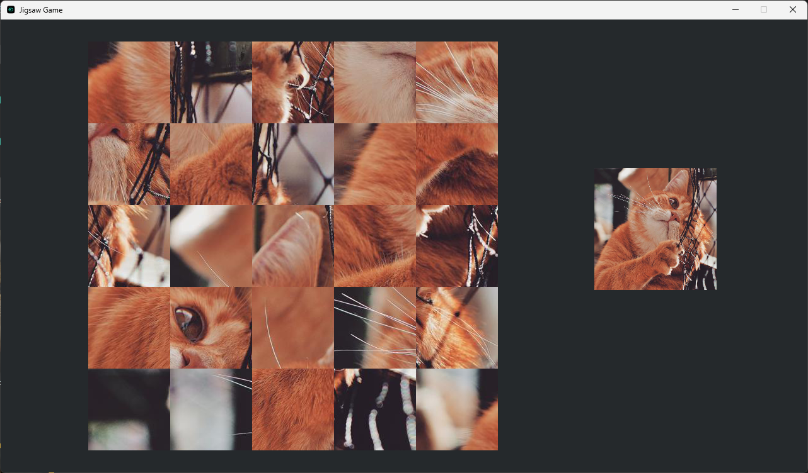

## **JigsawGame**

### 📷 Screenshots

### 📝 Overview

**JigsawGame** is a simple JavaFX puzzle game that lets players piece together jigsaw puzzles with varying levels of difficulty. Players can choose between four challenge modes, making it perfect for both casual players and those who enjoy a bit more complexity.

### 🎯 Features

* **4 Difficulty Levels** – Ranging from beginner-friendly to challenging.
* **Drag-and-Drop Gameplay** – Simple mouse-based interaction for placing pieces.
* **Relaxing Puzzle Experience** – No timers, just pure puzzle enjoyment.
* **Lightweight JavaFX Application** – Minimal resource usage for smooth performance.

### 🧰 Tech Stack

* **JavaFX** – Puzzle rendering and UI
* **Java** – Game logic and difficulty handling

### 👤 Author

* GitHub: [@AceBurgundy](https://github.com/AceBurgundy)
